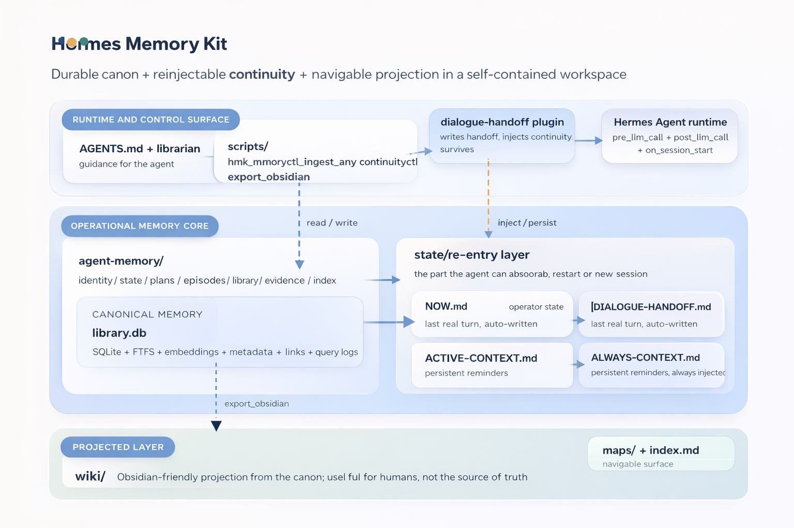

<p align="center">
  <h1 align="center">🧠 Hermes Memory Kit</h1>
</p>

<p align="center">
  <em>Operational memory stack for Hermes-style agents — durable canon + handoff + auto-injected continuity across sessions.</em>
</p>

<p align="center">
  <a href="LICENSE"></a>
  
  
  
</p>

---

## TL;DR

**Hermes Memory Kit** is not just a SQLite memory store. It is an **operational memory stack for agents**: durable canon (`library.db`), curated retrieval, conversational handoff after crash/restart, and auto-injected continuity on re-entry.

The core idea is this:

> **Agent memory is not just what gets stored; it is also what the agent can automatically reabsorb when it comes back.**

A single command bootstraps a self-contained workspace. If you also run Hermes Agent, the `dialogue-handoff` plugin turns that workspace into a memory layer that **survives restarts, session resets, and continuity loss** without manual copy-paste.

No Docker, no Postgres, no heavyweight services. One SQLite file + Python scripts + a shell wrapper.

---

## Table Of Contents

- [Who Is It For?](#who-is-it-for)
- [Quick Start](#quick-start)
- [What Is Included?](#what-is-included)
- [Architecture](#architecture)
- [Operational Memory: Canon + Handoff + Auto-Injection](#operational-memory-canon--handoff--auto-injection)
- [Workspace Layout](#workspace-layout)
- [Essential Commands](#essential-commands)
- [Configuration](#configuration)
- [Compatibility](#compatibility)
- [Design Principles](#design-principles)
- [Repo Status](#repo-status)
- [Docs](#docs)
- [Contributing](#contributing)
- [License](#license)

---

## Who Is It For?

- You run **Hermes Agent** (or a similar agent framework) and need your agent to **pick the thread back up** across sessions without re-explaining everything.
- You want a **local memory layer** without sending your data to cloud services.
- Your hardware is modest. SQLite plus API embeddings is enough; no need for Docker + Postgres + Neo4j.
- You want a **librarian** deciding what context to retrieve and inject, not an indiscriminate memory dump.
- You care about the most annoying production case too: **crash, reset, new session, lost agent**.

---

## Quick Start

> 💡 **Requirement**: Python 3.10+.

```bash
# 1. Clone the kit
git clone https://github.com/Mar-IA-no/hermes-memory-kit.git
cd hermes-memory-kit

# 2. Install dependencies
pip install -r requirements.txt

# 3. Bootstrap your workspace (self-contained: scripts, plugins, templates)
python3 scripts/bootstrap_workspace.py --workspace ~/my-workspace --with-wiki-templates

# 4. Configure + initialize
cd ~/my-workspace
cp .env.example .env        # edit if needed; defaults are relative to the workspace
./scripts/hmk memoryctl.py init

# 5. Store and retrieve
./scripts/hmk memoryctl.py add-text --shelf library --title "hello" --raw "my first memory" --tags note
./scripts/hmk memoryctl.py hybrid-pack --query "hello" --limit 3
```

That is it. The DB lives at `~/my-workspace/agent-memory/library.db` and you can run the scripts through the `./scripts/hmk` wrapper.

If you run Hermes Agent, the next step is enabling `plugins/dialogue-handoff/`: that is where the kit stops being just storage and becomes **operational memory with automatic re-entry**.

---

## What Is Included?

| Component | File / path | What it does |
|---|---|---|
| 🧩 **dialogue-handoff plugin** | `templates/plugins/dialogue-handoff/` | continuity auto-injection layer that recovers the most recent useful arc when a new session starts |
| 📦 **memoryctl** | `scripts/memoryctl.py` | SQLite canon + FTS5 + embeddings (NVIDIA / Google / local) + lexical and hybrid retrieval |
| 🗃 **ingest_any** | `scripts/ingest_any.py` | normalizes PDFs, DOCX, HTML, and MD to markdown before storage |
| 🗺 **export_obsidian** | `scripts/export_obsidian.py` | projects the canon into an Obsidian / LLM wiki vault |
| 🔁 **continuityctl** | `scripts/continuityctl.py` | tactical rehydration after restart/crash — returns identity + meta_context + dialogue_handoff as consumable JSON |
| ⚙️ **hmk wrapper** | `scripts/hmk` | shell wrapper that loads `.env`, absolutizes relative paths, and `cd`s into the workspace |
| 📋 **templates** | `templates/` | AGENTS.md + librarian skill + memory structure ready for your workspace |
| 🧪 **smoke-test** | `scripts/smoke-test.sh` | end-to-end kit verification |

---

## Architecture

<p align="center">
  
</p>

**Three layers together form operational memory**:

- `library.db` → **durable canon** (source of truth, FTS5 + embeddings, precise)
- `DIALOGUE-HANDOFF.md` + `ALWAYS-CONTEXT.md` → **reinjectable continuity** (what the agent needs to reabsorb on return)
- `wiki/` → **projection** (Obsidian-style human navigation generated from the canon)

---

## Operational Memory: Canon + Handoff + Auto-Injection

The most differentiated part of the kit is not just that it stores memory. It makes memory **usable after a real interruption**.

The problem it solves is not abstract:

> **"I open Hermes, say 'continue', and it asks what we were talking about."**

In this repo, that **is also agent memory**. It is not an accessory bolted onto storage. It is the missing half of the system.

That is why the kit relies on two complementary pieces:

- **Durable canon**: `memoryctl.py` + `library.db` store and retrieve knowledge in a curated way.
- **Injectable continuity**: `dialogue-handoff` + `continuityctl.py` let the agent re-enter with conversational thread, working set, and persistent reminders.

The `dialogue-handoff` plugin (v2.1) implements that second half with **two layers**:

- **Volatile layer** (`DIALOGUE-HANDOFF.md`) — the last turn + recent arc, written after each interaction via `post_llm_call`. Tiered-compressed:

| Tier | Scope | Verbosity |
|---|---|---|
| 1 | last 2 exchanges | verbatim, 300 chars/msg |
| 2 | exchanges 3-6 | headline, 150 chars/msg |
| 3 | exchanges 7-20 | stride 1-of-3, 80 chars/msg |
| 4 | > 20 | dropped |

Budget: 6000 chars. Position-aware: most recent items stay at the end to beat "lost-in-the-middle".

- **Persistent layer** (`ALWAYS-CONTEXT.md`) — imperative reminders about workspace capabilities ("use memoryctl BEFORE grep"). User-editable, 1000-char budget, always injected if present — even when the handoff is empty or stale. It solves the common problem where the model "forgets" that the memory system exists.

**Gates** to avoid noise: it does not inject on subsequent turns, on `/` commands, or if the handoff is older than 24h.

👉 See [docs/dialogue-handoff.md](docs/dialogue-handoff.md) for installation and wiring.

Without the plugin, the kit is still a good local memory store. With the plugin, it becomes **re-entry operational memory**: the agent not only remembers things, it also **resumes the conversation**.

---

## Workspace Layout

After `bootstrap_workspace.py --workspace ~/my-workspace --with-wiki-templates`:

```text
my-workspace/
├── AGENTS.md                     ← agent guidance for using the kit
├── .env.example                  ← copy to .env and adjust
├── scripts/
│   ├── hmk                       ← wrapper — loads .env, cd to workspace
│   ├── memoryctl.py              ← main CLI
│   ├── ingest_any.py
│   ├── export_obsidian.py
│   ├── continuityctl.py
│   └── smoke-test.sh
├── agent-memory/
│   ├── library.db                ← canon (created by memoryctl init)
│   ├── state/
│   │   ├── NOW.md
│   │   └── DIALOGUE-HANDOFF.md   ← auto-written by plugin
│   ├── identity/  plans/  episodes/  library/  evidence/  index/
├── skills/
│   └── memory/librarian/SKILL.md ← instructs the agent on curation
├── plugins/
│   └── dialogue-handoff/         ← re-entry / continuity layer for Hermes
└── wiki/
    ├── index.md
    └── maps/                     ← projection from the canon
```

---

## Essential Commands

Use everything through the `./scripts/hmk` wrapper so `.env` loads automatically:

```bash
# Initialize DB
./scripts/hmk memoryctl.py init

# Show embedding config
./scripts/hmk memoryctl.py embed-config

# Add direct text
./scripts/hmk memoryctl.py add-text --shelf library --title "X" --raw "content" --tags t1,t2

# Ingest a file (PDF / DOCX / HTML / MD)
./scripts/hmk ingest_any.py --source /path/file.pdf --shelf evidence --title "paper-x" --tags pdf

# Lexical search
./scripts/hmk memoryctl.py search --query "..." --limit 5

# Hybrid retrieval (lexical + semantic) with token budget
./scripts/hmk memoryctl.py hybrid-pack --query "..." --budget 1800 --limit 4 --threshold 0.4

# Expand a specific chunk
./scripts/hmk memoryctl.py expand --id 42

# Stats
./scripts/hmk memoryctl.py stats

# Tactical rehydration (to summarize context after restart)
./scripts/hmk continuityctl.py rehydrate

# Project to Obsidian
./scripts/hmk export_obsidian.py --ids 1 2 3

# Smoke test for the full kit
./scripts/smoke-test.sh
```

---

## Configuration

The `./scripts/hmk` wrapper loads `.env` from the workspace root, **absolutizes** any relative path against that root, and `cd`s into the workspace before execution. The defaults in `.env.example` use relative paths (`./agent-memory`), so they work without editing.

Variables (all optional — sensible fallbacks exist):

| Variable | What it is for | Default |
|---|---|---|
| `HMK_BASE_DIR` | where memory/state/DB live | `./agent-memory` |
| `HMK_DB_PATH` | SQLite library | `./agent-memory/library.db` |
| `HMK_VAULT_DIR` | target for Obsidian projection | `./wiki` |
| `HMK_HERMES_HOME` | Hermes Agent home (for the plugin) | — |
| `HMK_AGENT_MEMORY_BASE` | alias for BASE_DIR (used by the plugin) | — |
| `HMK_DIALOGUE_HANDOFF_PATH` | direct path to the handoff (override) | — |
| `HERMES_EMBED_PROVIDER` | `nvidia` / `google` / `local` | `nvidia` |
| `HERMES_EMBED_MODEL` | provider model | (see providers.md) |
| `NVIDIA_API_KEY` | key for NVIDIA NIM | — |
| `GEMINI_API_KEY` | key for Google Gemini embeddings | — |

See [docs/install.md](docs/install.md) for the full setup flow and [docs/providers.md](docs/providers.md) for embedding alternatives.

---

## Compatibility

- **Python**: 3.10+ (tested on 3.12)
- **Linux**: tested on Ubuntu 22.04+ / Debian 12+ / Linux Mint 22
- **Hermes Agent plugin**: pinned to **v0.10.0** (upstream commit `e710bb1f`, release 2026.4.16). Requires hooks `pre_llm_call`, `post_llm_call`, `on_session_start`. Not tested against earlier releases.

---

## Design Principles

- **Canon first, projection after** — `library.db` is truth; `wiki/` is only navigation.
- **Continuity is also memory** — crash recovery, session handoff, and re-entry are not “nice to have”; they are part of the system.
- **Local by default** — SQLite + API embeddings. No heavyweight services.
- **Decoupled embeddings** — you can switch providers without re-ingesting.
- **Null retrieval is OK** — if top-k does not clear the threshold, return empty rather than padding with noise.
- **Zero background loops** — nothing runs by itself unless you ask for it.
- **Self-contained workspace** — each workspace is a directory with everything it needs, scripts included.
- **Graceful degradation** — without the plugin you get canon + retrieval; with the plugin you get the full operational memory experience.

---

## Repo Status

| Area | Status |
|---|---|
| dialogue-handoff plugin | ✅ v2.1 (always-context + handoff layers), manually tested with Hermes v0.10.0 |
| memoryctl (retrieval + storage) | ✅ stable |
| bootstrap + workspace upgrade | ✅ stable (smoke test passes) |
| ingest_any | 🟡 works, but deps (`mammoth`, `markdownify`, `trafilatura`) must be installed |
| export_obsidian | ✅ stable |
| continuityctl | ✅ ported from the live system, stable |
| CI / pyproject.toml | ⏳ pending — local smoke test only for now |

This repo is a portable extraction of a real experimental memory system. It has already been decoupled from heavy fixed paths and now includes a smoke test. It is still in hardening mode; issues and PRs are welcome.

---

## Docs

- 📖 [Install](./docs/install.md) — full workflow with wrapper + plugin install
- 🏗 [Architecture](./docs/architecture.md) — data model and decisions
- 🧩 [Dialogue Handoff plugin](./docs/dialogue-handoff.md) — how auto-injection works
- 🔌 [Providers](./docs/providers.md) — embeddings (NVIDIA / Google / local)
- 📚 [Curation Pipeline](./docs/curation-pipeline.md) — curation workflow

---

## Contributing

PRs and issues are welcome. Before contributing:

1. Run the smoke test: `./scripts/smoke-test.sh` must pass.
2. If you add a new script, make sure it works through the `./scripts/hmk` wrapper.
3. If you change the plugin, test it manually against Hermes Agent (see [docs/dialogue-handoff.md](docs/dialogue-handoff.md)).

There is no CI yet — the local smoke test is the gate.

---

## License

[MIT](LICENSE)

---

<p align="center">
  <sub>Built as a portable extraction of a real memory system.<br>
  If it helps, a ⭐ makes it easier for others to find.</sub>
</p>
